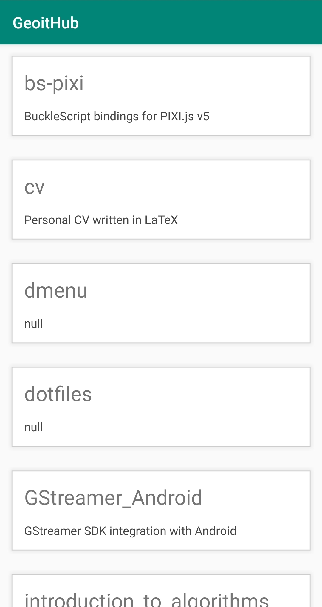

# GeoitHub

Android app structured using Android Jetpack [Architecture Components](https://developer.android.com/jetpack#architecture-components), more specifically, CardLayout and volleyHttp request, to fetch and display all GitHub repos from an specified account.

This application is intended to demonstrate Android developers guide [Common architectural principles](https://developer.android.com/jetpack/guide#common-principles).

### Usage

To display the repos on a card layout on MainFragment.kt substitute *GITHUB_ACCOUNT_USERNAME*:

```Kotlin
viewModel = ViewModelProviders.of(
                this,
                mainViewModelFactory {
                    MainViewModel(
                        "https://api.github.com/users/GITHUB_ACCOUNT_USERNAME/repos",
                        context
                    )
                }
        ).get(MainViewModel::class.java)
```

### Demo


